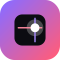
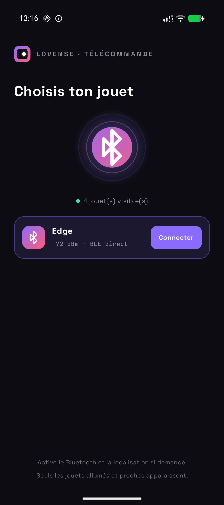
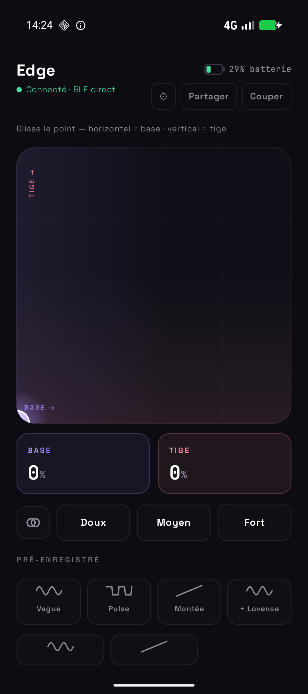
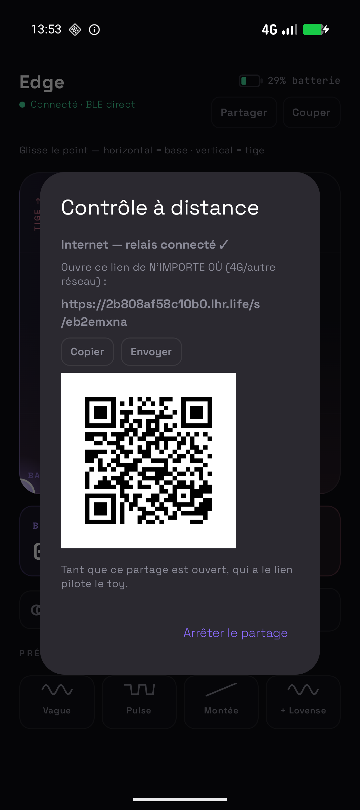

<div align="center">



# Lovense Remote

**Drive your Lovense toys over direct Bluetooth — no app, no account, no cloud.**

Open-source Android remote. Multiple toys supported, the UI adapts to each one.

<p>
  
  
  
  
  
</p>

&nbsp;
&nbsp;


</div>

> ⚠️ Experimental community project. **Not affiliated with Lovense.**

---

## ✨ Features

- **🔵 Direct BLE** — scan, connect and drive the toy straight from your phone.
- **🧸 Multi-toy** — Lush, Hush, Edge, Nora, Max, Domi, Ferri, Gemini… the UI
  adapts to each toy's actuators (vibration, dual motor, rotation, suction).
- **👍 One-hand XY pad** — one thumb drives both motors of two-motor toys.
- **🎛 Patterns** — built-ins, Lovense `.ta` import, a random **Tease** mode, and
  a **record** mode (perform → saved pattern).
- **🔗 Remote by link** — let a partner control the toy from the **same Wi-Fi** or
  **over the internet / 4G**, gated by a **per-session PIN**, an accept/refuse
  prompt and auto-expiry.
- **🌙 Background** — keeps the link alive when the app is closed, plus a
  quick-settings **STOP** tile.
- **🌍 i18n & themes** — French / English / Spanish, dark & light.
- **🟢 100 % AOSP** — no Google Play Services (GrapheneOS-friendly).

## 📲 Install

Grab the signed APK from the [latest release](https://github.com/kerstz/lovense-remote/releases/latest),
or build it yourself.

> Heads up: if you use a firewall / network-control app, allow **network access**
> for the app, otherwise link-sharing can't open its socket.

## 🛠 Build

```bash
ANDROID_HOME=~/Android/Sdk ./gradlew :app:assembleDebug
```

Kotlin + Jetpack Compose · minSdk 26 · target/compile SDK 35.

<details>
<summary>🧩 Architecture</summary>

- `ble/` — Lovense BLE layer: scan, GATT, per-actuator commands, toy registry
  (see [`docs/research/lovense-ble-protocol.md`](docs/research/lovense-ble-protocol.md)).
- `RemoteEngine` — process-scoped core (BLE + server + tunnel + state) so control
  survives the Activity / the app being closed.
- `remote/` — embedded HTTP+WS server, web control page
  (`assets/controller.html`), and the internet tunnel (`SshTunnel`,
  via [localhost.run](https://localhost.run)).

</details>

## 🔒 Privacy

LAN sharing stays on your network. Internet sharing routes traffic through
**localhost.run** (a third party); the control link is gated by a per-session
PIN + accept/refuse, and the session auto-expires.

## ⚖️ License

[GPLv3](LICENSE). Not affiliated with, or endorsed by, Lovense.
